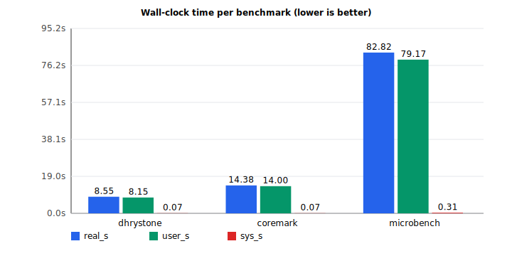
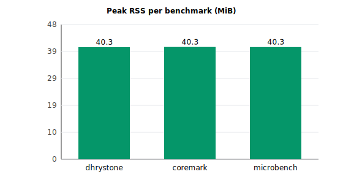
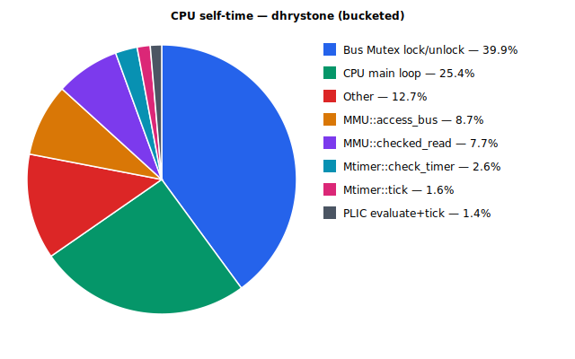
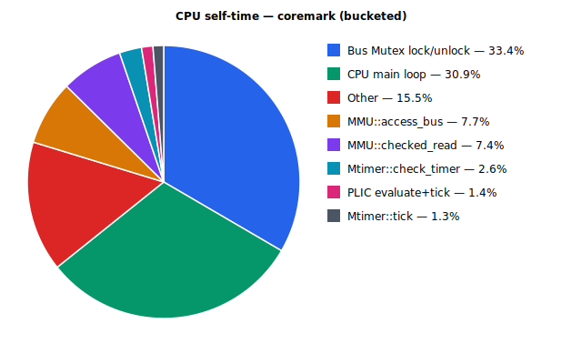
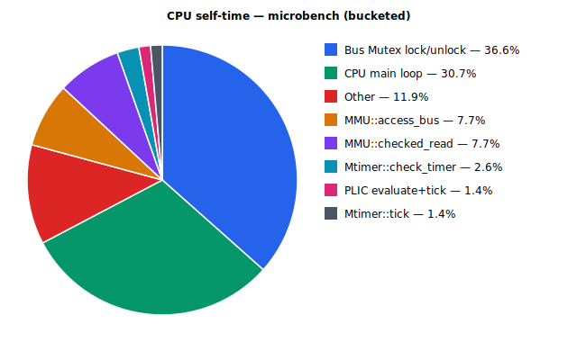
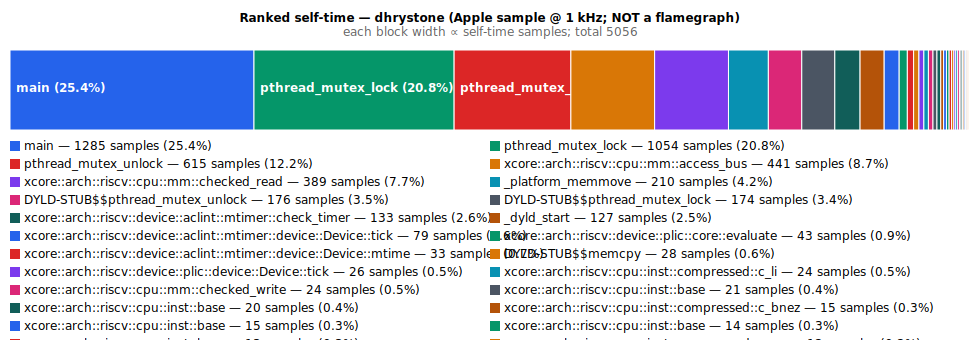
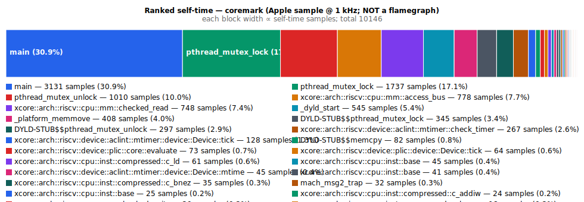
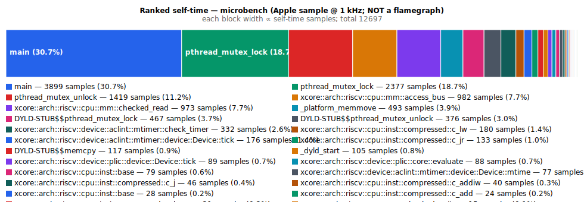

# xemu Performance Analysis — 2026-04-14

This report captures a single-hart baseline of xemu on macOS / Apple
Silicon, prior to the Phase-9 performance work.  All numbers here were
produced by running the project's own Makefile workloads (`make run`
from each benchmark directory) through the committed scripts under
`scripts/perf/`; no ad-hoc binary invocations were used.

- **Host:** MacBook Air, Apple M-series (arm64), macOS 26.3.1 (build `25D771280a`)
- **Toolchain:** `rustc 1.96.0-nightly (03749d625 2026-03-14)` / `cargo 1.96.0-nightly`
- **xemu profile:** `release` (`opt-level=3`, `lto=true`, `codegen-units=1`), no `debug` feature
- **Logging:** `X_LOG=off`, `DEBUG=n` via each benchmark Makefile
- **Guest ISA:** `riscv64gc` (rv64imafdc + Sstc)
- **Tooling revision:** stamped into `data/bench.summary` header

---

## 1. Tools used

| Layer | Tool | Purpose | Output |
|-------|------|---------|--------|
| Wall-clock timing | `/usr/bin/time -l` | Real/user/sys time + max-RSS per run | [`data/*.run*.time`](data/) |
| Bench harness | [`scripts/perf/bench.sh`](../../../scripts/perf/bench.sh), 3 iters | Aggregated CSV and summary | [`data/bench.csv`](data/bench.csv) |
| CPU sampling profiler | Apple `/usr/bin/sample` @ 1 ms | Call tree + "Sort by top of stack" self-time table | [`data/*.sample.txt`](data/) |
| Sample harness | [`scripts/perf/sample.sh`](../../../scripts/perf/sample.sh) | Walks descendants of `make run` to attach sampler to the correct xdb PID | one `*.sample.txt` per workload |
| Visualisation | [`scripts/perf/render.py`](../../../scripts/perf/render.py) | SVG bars + pies + self-time bar; stdlib-only | [`graphics/*.svg`](graphics/) |

Reference material consulted for tool selection: the Rust Performance
Book, `flamegraph-rs/flamegraph`, `mstange/samply`,
`sharkdp/hyperfine`, ntietz's *Profiling Rust programs the easy way*.
Sources at the bottom of this doc.

### Reproducing this run

```bash
# Pre-build each kernel (bench.sh also does this, but doing it once
# keeps the first iteration comparable to subsequent ones).
for k in coremark dhrystone microbench; do
  make -C xkernels/benchmarks/$k kernel
done

# Wall-clock + RSS, 3 iterations per workload.
bash scripts/perf/bench.sh --out docs/perf/2026-04-14

# CPU sampling profile — one capture per workload, PID-scoped to the
# correct make_pid descendant.
bash scripts/perf/sample.sh --out docs/perf/2026-04-14

# All SVGs (bench bars, hotspot pies, self-time bars).
python3 scripts/perf/render.py --dir docs/perf/2026-04-14
```

---

## 2. Wall-clock & memory baseline

Each benchmark run 3× via `make run` (raw data in
[`data/bench.csv`](data/bench.csv)).

| Workload    | Guest work           | Wall-clock (min / mean / max) | User (mean) | Peak RSS |
|-------------|----------------------|-------------------------------|-------------|----------|
| dhrystone   | 500 000 iters        | **8.55s** / 8.69s / 8.81s     | 8.09s       | ~40.3 MiB |
| coremark    | 1 000 iters          | **14.38s** / 14.88s / 15.76s  | 14.02s      | ~40.3 MiB |
| microbench  | 10 kernels (ref set) | **82.82s** / 88.19s / 92.00s  | 85.82s      | ~40.3 MiB |

`sys` time is <0.4 s for every run — I/O and syscalls are negligible.
This is a compute-bound, single-hart workload; every wall-clock second
is spent in `xcore` user code.

### Figure 1 — Wall-clock time (grouped bar)



### Figure 2 — Peak RSS (MiB)



RSS is flat across workloads (~40 MiB). None of these benchmarks
allocate large guest structures. **Memory is not the bottleneck.**

---

## 3. CPU sampling profile (Apple `sample`, 1 ms sampling)

`/usr/bin/sample` attaches to the live `xdb` PID for a fixed duration
and emits a call tree plus a *Sort by top of stack* table. The
denominator for every percent in this section is **the sum of counts
in that table** for the workload in question — one value per file.

| Workload    | Raw file | Samples (sum of *Sort by top of stack*) | Sample window |
|-------------|----------|----------------------------------------:|---------------|
| dhrystone   | [`data/dhrystone.sample.txt`](data/dhrystone.sample.txt) | 5 056 | 6 s (mid-run) |
| coremark    | [`data/coremark.sample.txt`](data/coremark.sample.txt)   | 10 146 | 12 s (mid-run) |
| microbench  | [`data/microbench.sample.txt`](data/microbench.sample.txt) | 12 697 | 15 s (early-mid run) |

Each capture targets a distinct `xdb` PID (check with `head -1` on the
`.sample.txt` files); the sampling harness refuses to run if a single
xdb descendant of `make run` cannot be resolved, so we don't silently
conflate workloads.

### 3.1 Dhrystone — self-time by function (total 5 056)

| # | Function | Samples | % |
|---|----------|--------:|---:|
| 1 | `xdb::main` (CPU dispatch + exec, monolithic after LTO) | 1 285 | 25.4 % |
| 2 | `pthread_mutex_lock` | 1 054 | 20.8 % |
| 3 | `pthread_mutex_unlock` | 615 | 12.2 % |
| 4 | `RVCore::access_bus` | 441 | 8.7 % |
| 5 | `RVCore::checked_read` | 389 | 7.7 % |
| 6 | `_platform_memmove` | 210 | 4.2 % |
| 7 | `DYLD-STUB$$pthread_mutex_unlock` | 176 | 3.5 % |
| 8 | `DYLD-STUB$$pthread_mutex_lock` | 174 | 3.4 % |
| 9 | `Mtimer::check_timer` | 133 | 2.6 % |
| 10 | `_dyld_start` | 127 | 2.5 % |
| 11 | `Mtimer::tick` (slow path) | 79 | 1.6 % |
| 12 | `Plic::Core::evaluate` | 43 | 0.9 % |
| 13 | `Mtimer::mtime` | 33 | 0.7 % |
| 14 | `Plic::tick` | 26 | 0.5 % |
| — | (everything else, individually < 0.5 %) | — | ~5.3 % |

Mutex-traffic share (rows 2 + 3 + 7 + 8) = **39.9 %**.

### 3.2 CoreMark — self-time by function (total 10 146)

| # | Function | Samples | % |
|---|----------|--------:|---:|
| 1 | `xdb::main` (hot loop) | 3 131 | 30.9 % |
| 2 | `pthread_mutex_lock` | 1 737 | 17.1 % |
| 3 | `pthread_mutex_unlock` | 1 010 | 10.0 % |
| 4 | `RVCore::access_bus` | 778 | 7.7 % |
| 5 | `RVCore::checked_read` | 748 | 7.4 % |
| 6 | `_dyld_start` | 545 | 5.4 % |
| 7 | `_platform_memmove` | 408 | 4.0 % |
| 8 | `DYLD-STUB$$pthread_mutex_lock` | 345 | 3.4 % |
| 9 | `DYLD-STUB$$pthread_mutex_unlock` | 297 | 2.9 % |
| 10 | `Mtimer::check_timer` | 267 | 2.6 % |
| 11 | `Mtimer::tick` | 128 | 1.3 % |
| 12 | `Plic::Core::evaluate` | 73 | 0.7 % |
| 13 | `Plic::tick` | 64 | 0.6 % |
| 14 | `RVCore::c_ld` | 61 | 0.6 % |
| — | (everything else) | — | ~5.4 % |

Mutex-traffic share = **33.4 %**.

### 3.3 MicroBench — self-time by function (total 12 697, mid-run window)

| # | Function | Samples | % |
|---|----------|--------:|---:|
| 1 | `xdb::main` (hot loop) | 3 899 | 30.7 % |
| 2 | `pthread_mutex_lock` | 2 377 | 18.7 % |
| 3 | `pthread_mutex_unlock` | 1 419 | 11.2 % |
| 4 | `RVCore::access_bus` | 982 | 7.7 % |
| 5 | `RVCore::checked_read` | 973 | 7.7 % |
| 6 | `_platform_memmove` | 493 | 3.9 % |
| 7 | `DYLD-STUB$$pthread_mutex_lock` | 467 | 3.7 % |
| 8 | `DYLD-STUB$$pthread_mutex_unlock` | 376 | 3.0 % |
| 9 | `Mtimer::check_timer` | 332 | 2.6 % |
| 10 | `RVCore::c_lw` (compressed inst) | 180 | 1.4 % |
| 11 | `Mtimer::tick` | 176 | 1.4 % |
| 12 | `RVCore::c_jr` | 133 | 1.0 % |
| 13 | `Plic::tick` | 89 | 0.7 % |
| — | (everything else) | — | ~6.3 % |

Mutex-traffic share = **36.6 %**.

### Figure 3 — CPU self-time buckets (pie, bucketed from the raw table)

Dhrystone:  

CoreMark:   

MicroBench: 

`render.py` buckets the raw self-time table into categories
(bus-mutex, MMU entry, device ticks, CPU main loop, etc.); see
`_BUCKETS` in [`scripts/perf/render.py`](../../../scripts/perf/render.py).

### Figure 4 — Ranked self-time bars (NOT flamegraphs)

Each block's width is proportional to self-time samples. **These are
*not* flamegraphs** — there is no call-stack depth here. They are
useful as a quick ranked visualisation of the same table above; for a
true flamegraph use `samply record` against `make run` (Linux) or on
macOS after `samply setup`.

Dhrystone:  

CoreMark:   

MicroBench: 

---

## 4. Analysis

### 4.1 Bus-mutex traffic is the single biggest slice

`Arc<Mutex<Bus>>` (introduced with multi-hart support in `5e66d51`)
gates **every** memory access, device tick, IRQ evaluation, and trap
commit. On single-hart runs the mutex is uncontended, but the
uncontended fast path still costs a CAS + possible syscall, and the
mutex is acquired multiple times per guest instruction
(`step()` → `bus.tick()`, then each load/store in `access_bus`, plus
LR/SC reservations in atomic.rs).

**Mutex share, per workload:**
- dhrystone: 39.9 %
- coremark:  33.4 %
- microbench: 36.6 %

These are *self-time* samples on `pthread_mutex_lock` / `unlock` (and
the PLT stubs for them). They do not include the time spent in
`access_bus` (7–9 %) or `checked_read` (7–8 %), both of which also
take the same mutex — in other words, roughly half of CPU goes either
directly into the mutex or into the bus/MMU dispatch path that wraps
it.

This is the single largest optimisation opportunity. See
[`docs/PERF_DEV.md`](../../PERF_DEV.md) phase **P1 — Single-hart bus
fast path**.

### 4.2 `xdb::main` dominates after LTO

The interpreter's dispatch + decode + execute collapse into one
monolithic function under `lto = true`. That function is 25–31 % of
self-time, which is roughly what we would expect from a tight RISC-V
interpreter. Splitting this into an instruction-cache hit path
(see PERF_DEV.md P4) is the follow-up win once the mutex and MMU
dispatch are cheaper.

### 4.3 MMU entry ≈ 15 % even without a TLB miss

`RVCore::access_bus` (7.7–8.7 %) + `RVCore::checked_read` (7.4–7.7 %)
= **≈ 15 %**. Both run on every load/store. The TLB is a 64-entry
direct-mapped array (fast), so most of the cost is the non-TLB
scaffolding: permission bits, MPRV handling, bus-dispatch indirection.

### 4.4 `_platform_memmove` is a visible but small tax

4 % of self-time goes to libsystem `memmove`. This is the guest RAM
load/store shim (`bytemuck::copy_within` + friends). Non-trivial and
worth checking whether small-access paths (1/2/4/8-byte loads) can
skip the generic memmove in favour of direct `unsafe` typed reads —
but only *after* P1/P3.

### 4.5 ACLINT `check_timer` is ~2.6 %, not 20 %

Earlier runs mistakenly reported `check_timer` at 15–20 % because
three workloads ended up sharing a single `xdb` PID (see sampling-bug
fix in `scripts/perf/sample.sh`). With distinct captures, the
deadline-gate opportunity exists but the expected win is much smaller
than first claimed. We should still land PERF_DEV.md P3 because it's
cheap and trivially correct, but the roadmap's headline savings come
from P1.

### 4.6 Memory is a non-issue

Peak RSS is flat at 40 MiB across all workloads. No allocator
profiling is warranted at this stage.

---

## 5. Optimisation targets (cross-ref PERF_DEV.md)

The performance-development roadmap is at
[`docs/PERF_DEV.md`](../../PERF_DEV.md). For the single-hart baseline
captured here, the phase priorities line up as:

| Rank | Phase | Evidence in this report | Claimed win |
|------|-------|------------------------|-------------|
| 1 | P1 — Single-hart bus fast path | §4.1 (~33–40 % mutex share) | high |
| 2 | P4 — Decoded-instruction cache | §4.2 (main dominates) | medium |
| 3 | P5 — MMU / trap inlining | §4.3 (~15 % MMU entry) | medium |
| 4 | P6 — `memmove` / device-tick gating | §4.4 (~4 % memmove) | low |
| 5 | P3 — Mtimer deadline gate | §4.5 (~2.6 % check_timer) | low |

Numbers were smaller than the previous iteration of this report had
them — the gates still belong in the roadmap, just at lower urgency.

---

## 6. What this report does **not** cover

- **SMP scaling.** Single-hart only. Multi-hart is a separate profile.
- **OS boot profiles** (Linux / Debian). Separate run, post-P1.
- **Hardware counters.** Would require Instruments.app (macOS GUI) or
  Linux `perf stat`. Not attempted here.
- **Heap profiling** (`dhat`). RSS flat → not worth attempting now.

---

## 7. Artifacts

Raw data and rendered graphics for this run live in this directory:

```
docs/perf/2026-04-14/
├── REPORT.md                         (this file)
├── data/
│   ├── bench.csv                     (workload,run,real_s,user_s,sys_s,max_rss_kb)
│   ├── bench.summary                 (perf-scripts revision + per-run summary)
│   ├── <workload>.log
│   ├── <workload>.run{1,2,3}.time    (raw /usr/bin/time -l output)
│   └── <workload>.sample.txt         (Apple `sample` call-tree + self-time table)
└── graphics/
    ├── bench_time.svg
    ├── bench_rss.svg
    ├── hotspot_{dhrystone,coremark,microbench}.svg
    └── selftime_{dhrystone,coremark,microbench}.svg
```

The scripts that produced all of these live at
[`scripts/perf/`](../../../scripts/perf/); see
[`docs/perf/README.md`](../README.md) for the dated-runs layout.

---

## Sources

- Nicholas Nethercote, *The Rust Performance Book — Profiling*,
  <https://nnethercote.github.io/perf-book/profiling.html>
- `flamegraph-rs/flamegraph`, <https://github.com/flamegraph-rs/flamegraph>
- `mstange/samply`, <https://github.com/mstange/samply>
- ntietz, *Profiling Rust programs the easy way*,
  <https://www.ntietz.com/blog/profiling-rust-programs-the-easy-way/>
- QuarkAndCode, *Profiling Rust Made Easy: cargo-flamegraph, perf & Instruments*,
  <https://medium.com/@QuarkAndCode/profiling-rust-made-easy-cargo-flamegraph-perf-instruments-56b24dff6fca>
- *How to Profile Rust Applications with perf, flamegraph, and samply*,
  <https://oneuptime.com/blog/post/2026-01-07-rust-profiling-perf-flamegraph/view>
