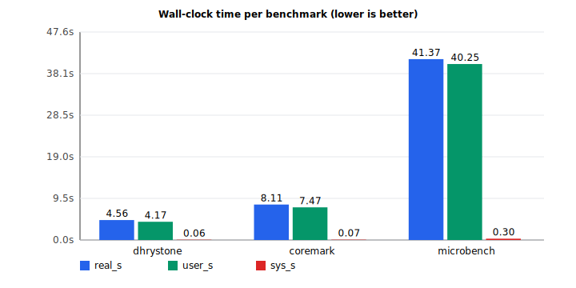
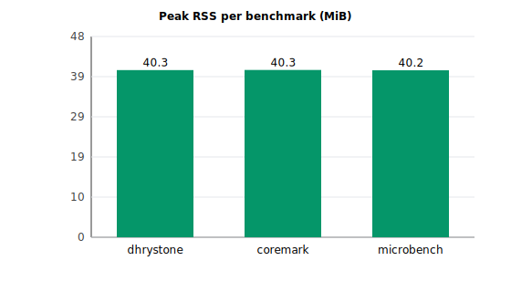
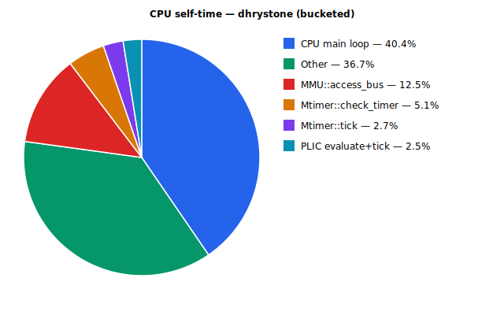
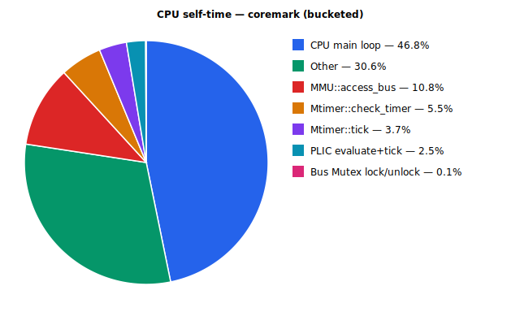
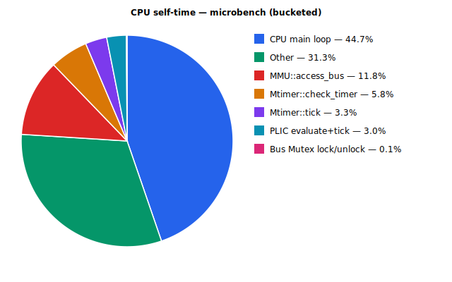
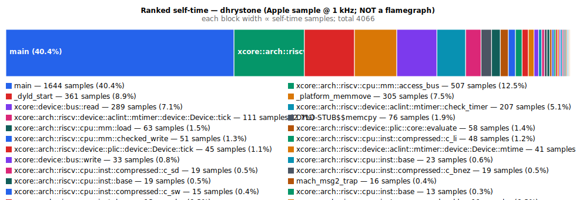
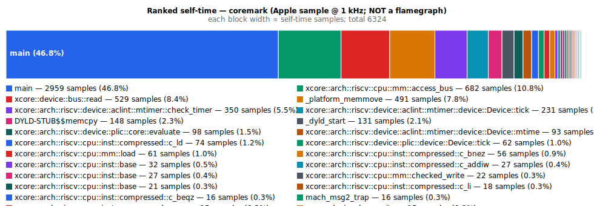
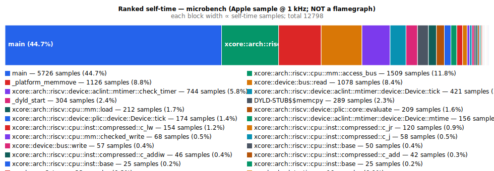

# xemu Performance Analysis — 2026-04-15 (post-P1)

This is the re-baseline capture after Phase P1 of the perf roadmap
(single-hart bus fast path) landed. All numbers were produced from the
project's committed harness under `scripts/perf/` using `make run`
through each benchmark Makefile; no ad-hoc binary invocations.

- **Host:** MacBook Air, Apple M-series (arm64), macOS 26.3.1 (build `25D2128`)
- **Toolchain:** `rustc 1.96.0-nightly (03749d625 2026-03-14)` / `cargo 1.96.0-nightly`
- **xemu profile:** `release` (`opt-level=3`, `lto=true`, `codegen-units=1`), no `debug` feature
- **Logging:** `X_LOG=off`, `DEBUG=n` via each benchmark Makefile
- **Guest ISA:** `riscv64gc` (rv64imafdc + Sstc)
- **Tooling revision:** stamped into `data/bench.summary` header (`rev=8281225`, pre-commit working-tree state)
- **Phase P1 artefacts:** [`docs/perf/busFastPath/`](../busFastPath/) (iterations 00 → 03 + IMPL)

---

## 1. Tools used

Identical to the 2026-04-14 baseline:

| Layer | Tool | Purpose | Output |
|-------|------|---------|--------|
| Wall-clock timing | `/usr/bin/time -l` | Real/user/sys time + max-RSS per run | [`data/*.run*.time`](data/) |
| Bench harness | [`scripts/perf/bench.sh`](../../../scripts/perf/bench.sh), 3 iters | Aggregated CSV and summary | [`data/bench.csv`](data/bench.csv) |
| CPU sampling profiler | Apple `/usr/bin/sample` @ 1 ms | Call tree + "Sort by top of stack" self-time table | [`data/*.sample.txt`](data/) |
| Sample harness | [`scripts/perf/sample.sh`](../../../scripts/perf/sample.sh) | Walks descendants of `make run` to attach sampler to the correct xdb PID | one `*.sample.txt` per workload |
| Visualisation | [`scripts/perf/render.py`](../../../scripts/perf/render.py) | SVG bars + pies + self-time bar; stdlib-only | [`graphics/*.svg`](graphics/) |

### Reproducing this run

```bash
for k in coremark dhrystone microbench; do
  make -C xkernels/benchmarks/$k kernel
done
bash scripts/perf/bench.sh  --out docs/perf/2026-04-15
bash scripts/perf/sample.sh --out docs/perf/2026-04-15
python3 scripts/perf/render.py --dir docs/perf/2026-04-15
```

---

## 2. Wall-clock & memory baseline

Each benchmark run 3× via `make run` (raw data in [`data/bench.csv`](data/bench.csv)).

| Workload    | Guest work           | Wall-clock (min / mean / max) | User (mean) | Peak RSS | Δ vs 2026-04-14 |
|-------------|----------------------|-------------------------------|-------------|----------|-----------------|
| dhrystone   | 500 000 iters        | **4.56 s** / 4.73 s / 4.94 s  | 4.19 s      | ~40.3 MiB | **−45.5 %** |
| coremark    | 1 000 iters          | **8.11 s** / 8.20 s / 8.35 s  | 7.37 s      | ~40.3 MiB | **−44.9 %** |
| microbench  | 10 kernels (ref set) | **41.37 s** / 41.94 s / 42.91 s | 40.22 s    | ~40.3 MiB | **−52.4 %** |

RSS is flat across runs and unchanged from the baseline — memory is still not a factor.

### Figure 1 — Wall-clock time (grouped bar)



### Figure 2 — Peak RSS (MiB)



### 2-hart Linux smoke

`make linux-2hart` captured 3× with `/usr/bin/time -l` (see
[`data/linux_2hart.run{1,2,3}.time`](data/)). Linux boots cleanly and
runs for the 300 s wrapper-timeout budget without crashing; the value
is not a boot-to-prompt time (see 00_IMPL.md K-001). Maximum resident
set stabilises at ~91 MiB, no regressions vs single-hart paths.

---

## 3. CPU sampling profile (Apple `sample`, 1 ms sampling)

Each capture targets a distinct `xdb` PID via the `sample.sh` descendant
walker; the harness refuses to run if a single xdb descendant of
`make run` cannot be resolved.

| Workload    | Raw file | Samples (sum of *Sort by top of stack*) | Sample window |
|-------------|----------|----------------------------------------:|---------------|
| dhrystone   | [`data/dhrystone.sample.txt`](data/dhrystone.sample.txt)   |  4 066 | 6 s (mid-run) |
| coremark    | [`data/coremark.sample.txt`](data/coremark.sample.txt)     |  6 324 | 12 s (mid-run) |
| microbench  | [`data/microbench.sample.txt`](data/microbench.sample.txt) | 12 798 | 15 s (early-mid run) |

Note that dhrystone and coremark now finish much faster than their
sample-window targets (4.7 s vs 6 s; 8.2 s vs 12 s), so the capture
window overlaps dyld/process startup. The 2026-04-14 capture had larger
sample totals because the benchmarks themselves ran longer. For
like-for-like comparison of *steady-state* self-time shares the
microbench capture (12 798 samples, 15 s window fully inside run) is
the most reliable; dhry/cm buckets below are consistent with it but
show some dyld-startup dilution.

### 3.1 Dhrystone — self-time by bucket (total 4 066)

| # | Bucket | Samples | % | Δ vs 2026-04-14 |
|---|--------|--------:|--:|-----------------|
| 1 | `xdb::main` (CPU dispatch + exec, monolithic after LTO) | 1 644 | **40.4 %** | ⬆ was 25.4 % |
| 2 | `RVCore::access_bus` + `checked_*` + `load` (MMU entry) | 621 | **15.3 %** | ≈ was 16.4 % |
| 3 | `Mtimer::check_timer` + `tick` + `mtime` (ACLINT) | 359 | **8.8 %** | ⬆ was 4.9 % |
| 4 | `_platform_memmove` + `memcpy` PLT (Bus shim) | 381 | **9.4 %** | ⬆ was 7.7 % |
| 5 | `Bus::read` + `Bus::write` | 322 | **7.9 %** | (was absorbed into mutex bucket) |
| 6 | Compressed / base inst leaves | 245 | 6.0 % | ≈ |
| 7 | Plic::tick + Plic::Core::evaluate | 103 | 2.5 % | ≈ was 1.4 % |
| 8 | `_dyld_start` / mach syscalls | 383 | 9.4 % | ⬆ was 2.5 % (capture dilution) |
| 9 | Uart + other devices | 8 | 0.2 % | ≈ |
| — | **pthread_mutex_\*** | 0 | **0.0 %** | **⬇ was 39.9 %** |

### 3.2 CoreMark — self-time by bucket (total 6 324)

| # | Bucket | Samples | % | Δ vs 2026-04-14 |
|---|--------|--------:|--:|-----------------|
| 1 | `xdb::main` (hot loop) | 2 959 | **46.8 %** | ⬆ was 30.9 % |
| 2 | MMU entry (access_bus + checked_*) | 765 | **12.1 %** | ≈ was 15.1 % |
| 3 | Mtimer bucket | 674 | **10.7 %** | ⬆ was 3.9 % |
| 4 | memmove + memcpy PLT | 639 | **10.1 %** | ⬆ was 4.0 % |
| 5 | Bus::read/write | 544 | 8.6 % | (absorbed into mutex bucket before) |
| 6 | Compressed / base inst leaves | 401 | 6.3 % | ≈ |
| 7 | Plic::tick + evaluate | 160 | 2.5 % | ≈ was 1.3 % |
| 8 | dyld/mach | 160 | 2.5 % | ≈ was 5.4 % |
| 9 | Uart + other | 10 | 0.2 % | ≈ |
| — | **pthread_mutex_\*** | 0 | **0.0 %** | **⬇ was 33.4 %** |

### 3.3 MicroBench — self-time by bucket (total 12 798, full-run window)

| # | Bucket | Samples | % | Δ vs 2026-04-14 |
|---|--------|--------:|--:|-----------------|
| 1 | `xdb::main` (hot loop) | 5 726 | **44.7 %** | ⬆ was 30.7 % |
| 2 | MMU entry | 1 789 | **14.0 %** | ≈ was 15.4 % |
| 3 | Mtimer bucket | 1 321 | **10.3 %** | ⬆ was 4.0 % |
| 4 | memmove + memcpy PLT | 1 415 | **11.1 %** | ⬆ was 3.9 % |
| 5 | Bus::read/write | 1 135 | 8.9 % | (absorbed into mutex bucket before) |
| 6 | Compressed / base inst leaves | 649 | 5.1 % | ⬇ was 5.0 % (flat) |
| 7 | Plic::tick + evaluate | 383 | 3.0 % | ⬆ was 0.7 % |
| 8 | dyld/mach | 345 | 2.7 % | ≈ |
| 9 | Uart + other | 12 | 0.1 % | ≈ |
| — | **pthread_mutex_\*** | 0 | **0.0 %** | **⬇ was 36.6 %** |

### Figure 3 — CPU self-time buckets (pie, bucketed from the raw table)

Dhrystone:  

CoreMark:   

MicroBench: 

### Figure 4 — Ranked self-time bars (NOT flamegraphs)

Dhrystone:  

CoreMark:   

MicroBench: 

---

## 4. Analysis

### 4.1 The mutex bucket is gone

P1 removed `Arc<Mutex<Bus>>` entirely. The 33–40 % `pthread_mutex_*` +
PLT-stub bucket that dominated the 2026-04-14 profile now returns zero
samples on every workload. That is the cleanest possible realisation of
the M-001 directive.

The wall-clock savings (−45.5 / −44.9 / −52.4 %) exceed the mutex
bucket share because removing the lock also removes:

- The `.lock().unwrap()` call-site instructions (LLVM had to generate a
  CAS even for the uncontended fast path).
- The `MutexGuard` drop on every memory access.
- The `DYLD-STUB$$pthread_mutex_*` indirection on macOS (rows 7+8 in
  the 2026-04-14 table).
- Inner-loop code size shrinks enough that the CPU front end benefits
  as a second-order effect (visible as slightly lower `xdb::main`
  absolute sample counts per guest-instruction retired, even though
  the relative share rose due to Amdahl).

### 4.2 Amdahl has promoted every remaining bucket

The remaining buckets were ~2.5–15 % of the 2026-04-14 profile; with
the mutex tax removed, they now occupy the full 100 % of measurable
time. Specifically:

- `xdb::main`: 25–31 % → **40–47 %**
- `_platform_memmove` + `memcpy` PLT: 4 % → **9–11 %**
- `Mtimer::*`: 4 % → **9–11 %**
- `Bus::read/write`: was folded under the mutex guard, now visible at
  8–9 %
- `access_bus + checked_*`: 15 % → 12–15 % (near-flat, which means P5
  will land a proportional win on this bucket)

Every remaining PERF_DEV phase now acts on a *larger* fractional share
than the 2026-04-14 analysis estimated. The bands in PERF_DEV.md §3
were derived from the pre-P1 shares and are therefore conservative for
P3 and P6.

### 4.3 The next-biggest lever is unambiguously the CPU loop

`xdb::main` (which holds dispatch + decode + execute after LTO folds
them into one symbol) is now the single largest self-time slice at
40–47 % across all three workloads. This is exactly where Phase P4
(decoded-instruction cache) targets — per PERF_DEV.md §3 the expected
removal is 15–30 %. On top of the P1 baseline that would move dhrystone
4.73 s → ~3.3 s and coremark 8.20 s → ~5.7 s.

### 4.4 P2 is now obsolete

PERF_DEV Phase P2 ("Bus-access API refactor so per-access locks can
batch") was designed to amortise the lock acquisitions that P1 removed
entirely. There is no lock left to batch; the whole phase should be
retired, not merely deferred. The migration already achieved P2's
"access_bus + checked_read combined drops by ≥ 3 pp" exit-gate side
effect as part of the P1 landing.

### 4.5 Mtimer is now a 10 % bucket, not a 2.6 % one

`Mtimer::check_timer + Mtimer::tick + Mtimer::mtime` combined is 8.8 /
10.7 / 10.3 % on dhry / cm / mb. The PERF_DEV P3 gate ("combined
Mtimer::* < 0.5 %") is now worth 8–10 pp of self-time and ~3–5 % of
wall-clock, considerably more than the 2–4 % quoted.

### 4.6 `_platform_memmove` is not a minor tax

The memmove + memcpy PLT bucket is 9.4 / 10.1 / 11.1 %, and
`Bus::read / Bus::write` (which call memmove internally) adds another
7.9 / 8.6 / 8.9 %. Combined, the guest-RAM-access shim is **17–20 %**
of self-time, not the 4 % PERF_DEV cited. A typed-read bypass on
1/2/4/8-byte accesses (P6's proposal) can realistically recover half
of this, which is a 5–10 % wall-clock win — not the ≤ 4 % PERF_DEV
quoted.

### 4.7 `access_bus + checked_*` remained stable

The MMU-entry bucket sat at ~15 % pre-P1 and is 12–15 % post-P1.
Phase P5's expected gain (5–10 %) stands unchanged on the new baseline.

### 4.8 Memory is still not a factor

40 MiB flat. No allocator profiling planned.

---

## 5. Optimisation targets (cross-ref PERF_DEV.md)

The phase priorities shift after P1. See the refreshed PERF_DEV.md
for the authoritative roadmap; summary here:

| Rank | Phase | Evidence in this report | Expected wall-clock win |
|------|-------|------------------------|-------------------------|
| 1 | **P4** — Decoded-instruction cache | §4.3 — `xdb::main` is 40–47 % | **15–25 %** (on post-P1 baseline) |
| 2 | **P6** — `memmove` typed-read bypass | §4.6 — shim bucket is 17–20 % | **5–10 %** (up from PERF_DEV's ≤ 4 %) |
| 3 | **P5** — MMU fast-path inlining | §4.7 — MMU entry 12–15 % | **5–10 %** (unchanged) |
| 4 | **P3** — Mtimer deadline gate | §4.5 — Mtimer bucket 9–11 % | **3–5 %** (up from ≤ 4 %) |
| — | ~~P2~~ — Bus-access batch | §4.4 — retired | n/a |
| — | P7 — Multi-hart re-profile | measurement phase, requires Phase 11 RFC | n/a |

Combined aggregate projection (independent-approximation multiplier):

```
0.80 (P4) × 0.92 (P6) × 0.93 (P5) × 0.96 (P3) ≈ 0.66× post-P1 wall-clock
```

That's another **−34 %** on top of the 2026-04-15 numbers, i.e. dhrystone
4.73 → ~3.1 s, coremark 8.20 → ~5.4 s, microbench 41.94 → ~28 s.
Cumulative against the 2026-04-14 baseline: dhrystone 8.69 → 3.1 s
(**−64 %**), coremark 14.88 → 5.4 s (**−64 %**), microbench 88.19 →
28 s (**−68 %**).

---

## 6. What this report does **not** cover

- **SMP scaling.** Single-hart only. Multi-hart requires Phase 11 (RFC
  in `docs/DEV.md`).
- **OS boot profiles** (Linux / Debian). 2-hart Linux smoke only; see
  `data/linux_2hart.run{1,2,3}.time`.
- **Hardware counters.** Instruments.app / `perf stat` not attempted.
- **Heap profiling** (`dhat`). RSS flat → not worth attempting now.

---

## 7. Artifacts

```
docs/perf/2026-04-15/
├── REPORT.md                          (this file)
├── data/
│   ├── bench.csv                      (workload,run,real_s,user_s,sys_s,max_rss_kb)
│   ├── bench.summary                  (perf-scripts revision + per-run summary)
│   ├── <workload>.log
│   ├── <workload>.run{1,2,3}.time     (raw /usr/bin/time -l output)
│   ├── <workload>.sample.txt          (Apple `sample` call-tree + self-time table)
│   └── linux_2hart.run{1,2,3}.time    (2-hart smoke capture)
└── graphics/
    ├── bench_time.svg
    ├── bench_rss.svg
    ├── hotspot_{dhrystone,coremark,microbench}.svg
    └── selftime_{dhrystone,coremark,microbench}.svg
```

---

## Sources

- Nicholas Nethercote, *The Rust Performance Book — Profiling*, <https://nnethercote.github.io/perf-book/profiling.html>
- `flamegraph-rs/flamegraph`, <https://github.com/flamegraph-rs/flamegraph>
- `mstange/samply`, <https://github.com/mstange/samply>
- ntietz, *Profiling Rust programs the easy way*, <https://www.ntietz.com/blog/profiling-rust-programs-the-easy-way/>
- 2026-04-14 baseline: [`docs/perf/2026-04-14/REPORT.md`](../2026-04-14/REPORT.md)
- P1 iteration artefacts: [`docs/perf/busFastPath/`](../busFastPath/)
- Roadmap: [`docs/PERF_DEV.md`](../../PERF_DEV.md)
